# idea-mill

LLMs famously struggle to come up with new ideas. This is an attempt to programmatically prompt a model to have new ideas, by seeding the prompt with interesting facts from a bunch of different domains. In theory the model can process many idea combinations and select the ones that are most interesting.

## Installation

```bash
npm install
```

## Usage

### Command Line Interface

```bash
# Basic usage
./idea-mill.js "improving developer productivity"

# With custom model and settings
./idea-mill.js --model deepseek-v3-0324 --samples 8 --temperature 0.9 "reducing cloud costs for Github Models"

# Using flags for the problem statement
./idea-mill.js -p "making CI/CD more resilient for a large Rails webapp" --primer-file ./custom-primers.yaml

# Get help
./idea-mill.js --help
```

### Options

- `-h, --help` - Show help message
- `-m, --model MODEL` - AI model to use (default: openai/gpt-4o)
- `-p, --problem PROBLEM` - Problem statement (alternative to positional argument)
- `-f, --primer-file FILE` - Path to primer YAML file (default: ./primer.yaml)
- `-s, --samples N` - Number of mechanism samples per round (default: 6)
- `-t, --temperature N` - AI temperature 0.0-1.0 (default: 0.7)
- `--token TOKEN` - API token (default: GITHUB_TOKEN env var)
- `--endpoint URL` - API endpoint (default: https://models.github.ai/inference)

### Environment Variables

- `GITHUB_TOKEN` - Required API token for GitHub Models. You can use a PAT with `models: read` permission, or if you have the Github CLI you can use that token via `gh auth token`

## Architecture

```mermaid
flowchart TD
    A[🎯 Problem Statement] --> B[📚 Load Primer YAML]
    B --> C[🎲 Sample N Random Mechanisms]
    C --> D{🔍 Analyze Connections}
    D --> E[💭 Generate Solution Ideas]
    E --> F[📊 Rank & Evaluate]
    F --> G[💡 Return Top Ideas]
    
    B1[🦎 Gecko adhesion<br/>van der Waals forces] --> C
    B2[🔐 SHA-256 hashing<br/>64 rounds of operations] --> C
    B3[🐝 Honeybee waggle dance<br/>direction encoding] --> C
    B4[⚡ Supercapacitor storage<br/>electrostatic energy] --> C
    B5[🍄 Mycelial networks<br/>nutrient transport] --> C
    B6[📡 TCP congestion control<br/>sawtooth patterns] --> C
    
    D --> D1[🔗 Find shared principles<br/>across domains]
    D --> D2[⚖️ Identify complementary<br/>strengths/weaknesses]
    D --> D3[🎭 Discover unexpected<br/>similarities]
    
    E --> E1[💡 Idea 1: Apply gecko<br/>adhesion to CI/CD]
    E --> E2[💡 Idea 2: Use TCP patterns<br/>for load balancing]
    E --> E3[💡 Idea 3: Mimic bee dance<br/>for status updates]
    E --> E4[💡 Idea 4: Supercapacitor<br/>burst patterns]
    E --> E5[💡 Idea 5: Mycelial routing<br/>for deployments]
    
    F --> F1[📈 Relevance Score<br/>1-10]
    F --> F2[🎯 Plausibility Score<br/>1-10]
    F --> F3[🧮 Combined Score<br/>relevance + plausibility]
    
    G --> H[🏆 Top 3 Ranked Ideas<br/>with scores & reasoning]
    
    style A fill:#ff6b6b,stroke:#d63031,stroke-width:2px,color:#fff
    style G fill:#00b894,stroke:#00a085,stroke-width:2px,color:#fff
    style H fill:#0984e3,stroke:#0672cc,stroke-width:2px,color:#fff
```



## Primer File Format

The primer file should be a YAML array of mechanism descriptions:

```yaml
- "Gecko adhesion relies on van der Waals forces between ~500,000 spatulae per toe..."
- "SHA-256 achieves cryptographic security through 64 rounds of bitwise operations..."
- "Honeybee waggle dance encodes distance as dance duration..."
```

Each mechanism should be a detailed description including specific numbers, processes, and constraints.